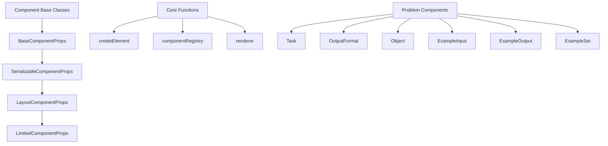
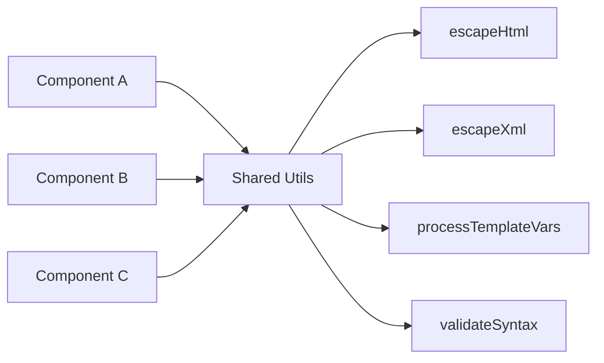
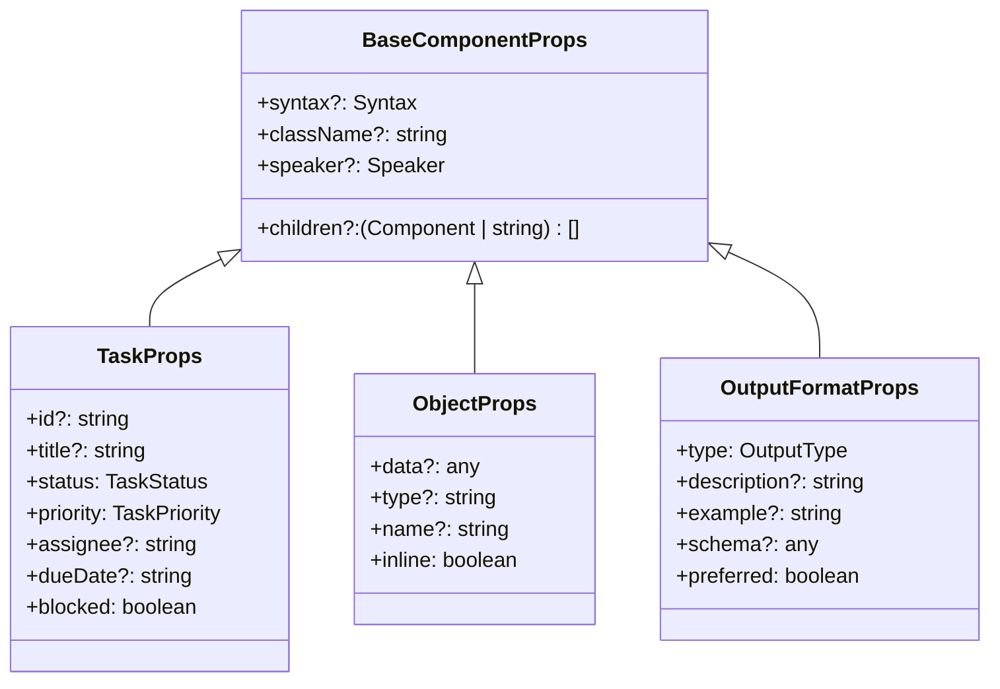
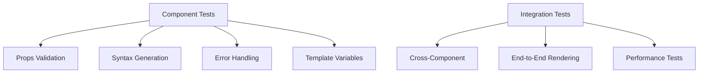

# Fix Component Errors Design Document

## Overview

This document outlines the analysis and solutions for fixing errors in the EPOML component library, specifically addressing issues in the Task, OutputFormat, Object, ExampleInput, ExampleOutput, and ExampleSet components. The errors are primarily related to TypeScript compilation issues, missing imports, inconsistent property handling, and syntax formatting problems.

## Architecture Analysis

### Current Component Structure



### Identified Error Categories

| Error Type | Components Affected | Severity | Impact |
|------------|-------------------|----------|---------|
| Missing Interface Props | Task, Object | High | TypeScript compilation failure |
| **Malformed Object Destructuring** | **19+ components** | **CRITICAL** | **Complete build failure - prevents TypeScript compilation** |
| Inconsistent Syntax Handling | OutputFormat, ExampleInput/Output | Medium | Runtime rendering issues |
| Improper Escaping Functions | All components | Medium | XSS vulnerabilities |
| Template Variable Support | All components | Low | Missing functionality |

## Component Error Analysis

### CRITICAL: Malformed Object Destructuring Syntax

#### Problem Scope:
After running build analysis, **19+ components** have critical syntax errors in their props destructuring that **prevent TypeScript compilation**. All affected components have malformed destructuring patterns like:

```typescript
// BROKEN - Missing comma causes syntax error
const {
  prop1,
  prop2,
  prop3 = defaultValue,
  children = []
  // Missing comma here!
} = props;
```

#### Affected Components:
- Bold.ts
- CaptionedParagraph.ts  
- Code.ts
- Document.ts
- ExampleInput.ts
- ExampleOutput.ts
- ExampleSet.ts
- Header.ts
- Hint.ts
- Image.ts
- Inline.ts
- Introducer.ts
- Object.ts
- OutputFormat.ts
- Question.ts
- Role.ts
- StepwiseInstructions.ts
- Table.ts
- Task.ts

#### Build Impact:
```bash
# When running pnpm run build, these errors occur:
TypeScript compilation fails with syntax errors
Cannot build package due to destructuring syntax issues
All 19+ components prevent successful compilation
```

### 1. Task Component Issues

#### Problems Identified:
- **Missing props validation**: The TaskProps interface doesn't properly extend BaseComponentProps
- **Inconsistent status/priority handling**: Missing default values in function signatures
- **Template variable support**: No support for dynamic content injection

#### Current Interface Issues:
```typescript
// Current problematic structure
export interface TaskProps extends BaseComponentProps {
  id?: string;
  title?: string;
  // Missing proper status/priority defaults
  status?: 'pending' | 'in-progress' | 'completed' | 'cancelled';
  priority?: 'low' | 'medium' | 'high' | 'critical';
}
```

### 2. OutputFormat Component Issues

#### Problems Identified:
- **Malformed function parameters**: Missing comma in props destructuring
- **Inconsistent format handling**: Type parameter conflicts between function signature and implementation
- **Missing error handling**: No validation for invalid syntax types

#### Current Props Structure Issues:
```typescript
// Problematic props destructuring
const {
  type,
  description,
  example,
  schema,
  preferred = false,
  syntax = 'text',
  className,
  speaker,
  children = []
  // Missing comma here causes syntax error
} = props;
```

### 3. Object Component Issues

#### Problems Identified:
- **Inconsistent inline parameter**: Missing inline parameter in some generator functions
- **Template variable gaps**: No support for variable substitution in object data
- **Type safety issues**: Missing proper typing for data parameter

### 4. Example Components Issues

#### Problems Identified:
- **Duplicate escape functions**: Each component defines its own escapeHtml/escapeXml functions
- **Inconsistent formatting**: Different components handle similar formatting differently
- **Missing accessibility attributes**: No ARIA labels or semantic structure

## Solution Architecture

### 1. Shared Utility Functions



### 2. Enhanced Interface Hierarchy



## Implementation Strategy

### IMMEDIATE CRITICAL FIXES (Required for Build Success)

Before any other work can proceed, the following syntax errors must be fixed to enable TypeScript compilation:

#### Step 1: Fix Destructuring Syntax (CRITICAL PRIORITY)

**Pattern to Fix:**
```typescript
// BROKEN (current state)
const {
  prop1,
  prop2,
  children = []
  // Missing comma here!
} = props;

// FIXED (required format)
const {
  prop1,
  prop2,
  children = []
} = props;
```

**Components requiring immediate syntax fix:**
1. Bold.ts - Line 33
2. CaptionedParagraph.ts - Line 57
3. Code.ts - Line 48
4. Document.ts - Line 26
5. ExampleInput.ts - Line 20
6. ExampleOutput.ts - Line 20
7. ExampleSet.ts - Line 23
8. Header.ts - Line 45
9. Hint.ts - Line 26
10. Image.ts - Line 35
11. Inline.ts - Line 24
12. Introducer.ts - Line 27
13. Object.ts - Line 24
14. OutputFormat.ts - Line 27
15. Question.ts - Line 32
16. Role.ts - Line 26
17. StepwiseInstructions.ts - Line 23
18. Table.ts - Line 30
19. Task.ts - Line 35

**Estimated Time:** 30 minutes (batch find/replace operation)
**Priority:** CRITICAL - Must be completed first
**Blocking:** All other development until fixed

### Phase 1: Core Infrastructure Fixes

#### 1.1 Create Shared Utilities Module
- Centralized escape functions
- Template variable processing
- Syntax validation
- Error handling utilities

#### 1.2 Fix Interface Definitions
- Ensure all props interfaces properly extend BaseComponentProps
- Add missing required properties with defaults
- Improve type safety with stricter typing

### Phase 2: Component-Specific Fixes

#### 2.1 Task Component Enhancements
- Fix props destructuring syntax errors
- Add proper default values for status and priority
- Implement template variable support
- Add validation for date formats

#### 2.2 OutputFormat Component Repairs
- Fix malformed parameter lists
- Standardize type handling across all syntax generators
- Add format validation
- Improve error messaging

#### 2.3 Object Component Improvements
- Ensure consistent parameter handling across all generators
- Add proper inline support for all formats
- Implement data validation
- Add template variable substitution

#### 2.4 Example Components Standardization
- Remove duplicate utility functions
- Standardize formatting patterns
- Add accessibility improvements
- Implement consistent error handling

### Phase 3: Testing and Validation

#### 3.1 Unit Testing Framework


#### 3.2 Test Coverage Areas
- All syntax format generators
- Error boundary conditions
- Template variable substitution
- Props validation
- Accessibility compliance

## Error Resolution Matrix

| Component | Error Type | Fix Priority | Estimated Effort | Dependencies | Status |
|-----------|------------|--------------|------------------|--------------|--------|
| **ALL 19+ Components** | **Destructuring Syntax** | **CRITICAL** | **30 minutes** | **None** | **BLOCKING BUILD** |
| Task | Syntax Error | Critical | 2 hours | Utils module, Syntax fix | After destructuring |
| OutputFormat | Parameter Error | Critical | 1 hour | Utils module, Syntax fix | After destructuring |
| Object | Type Error | High | 1.5 hours | Utils module, Syntax fix | After destructuring |
| ExampleInput | Duplication | Medium | 1 hour | Utils module, Syntax fix | After destructuring |
| ExampleOutput | Duplication | Medium | 1 hour | Utils module, Syntax fix | After destructuring |
| ExampleSet | Standards | Low | 0.5 hours | Utils module, Syntax fix | After destructuring |

## Quality Assurance Strategy

### Code Quality Measures
- **TypeScript strict mode**: Ensure all components compile without errors
- **ESLint compliance**: Follow project coding standards
- **Unit test coverage**: Minimum 90% coverage for all fixed components
- **Integration testing**: Verify components work together correctly

### Performance Considerations
- **Lazy loading**: Only load escape utilities when needed
- **Memoization**: Cache frequently used template variables
- **Bundle size**: Monitor impact of shared utilities on final bundle

### Security Measures
- **Input validation**: Validate all props before processing
- **Output sanitization**: Ensure all user content is properly escaped
- **Template injection prevention**: Secure template variable processing

## Risk Assessment

### High Risk Areas
1. **Breaking Changes**: Interface modifications may affect existing consumers
2. **Performance Impact**: Shared utilities could introduce overhead
3. **Security Vulnerabilities**: Improper escaping could lead to XSS

### Mitigation Strategies
1. **Backward Compatibility**: Maintain existing prop interfaces where possible
2. **Performance Testing**: Benchmark before and after changes
3. **Security Review**: Code review for all escaping and template functions

## Success Criteria

### Critical Build Success Metrics
- [ ] **IMMEDIATE**: `pnpm run build` completes without TypeScript compilation errors
- [ ] **IMMEDIATE**: All 19+ components pass syntax validation
- [ ] **IMMEDIATE**: No destructuring syntax errors remain

### Technical Metrics
- [ ] All TypeScript compilation errors resolved
- [ ] 100% test coverage for fixed components
- [ ] No runtime errors in component generation
- [ ] Consistent API across all components

### Functional Requirements
- [ ] All syntax formats render correctly
- [ ] Template variables work in all components
- [ ] Error handling provides meaningful messages
- [ ] Accessibility attributes present where needed

### Performance Benchmarks
- [ ] Component creation time < 5ms
- [ ] Memory usage increase < 10%
- [ ] Bundle size increase < 5KB

## Build Validation Checklist

### Pre-Fix Validation
```bash
# Current state - these commands should FAIL
cd /Users/utkarshshukla/Codebolt/EPOML
pnpm run build
# Expected: TypeScript compilation errors in 19+ components
```

### Post-Fix Validation
```bash
# After fixes - these commands should SUCCEED
cd /Users/utkarshshukla/Codebolt/EPOML
pnpm run build
# Expected: Clean build with no TypeScript errors

pnpm run check-types
# Expected: All type checks pass

pnpm run lint
# Expected: No linting errors
```

### Component-Specific Validation
```bash
# Test individual component compilation
cd packages/epoml
npx tsc --noEmit src/components/Task.ts
npx tsc --noEmit src/components/OutputFormat.ts
npx tsc --noEmit src/components/Object.ts
# Expected: No compilation errors
```